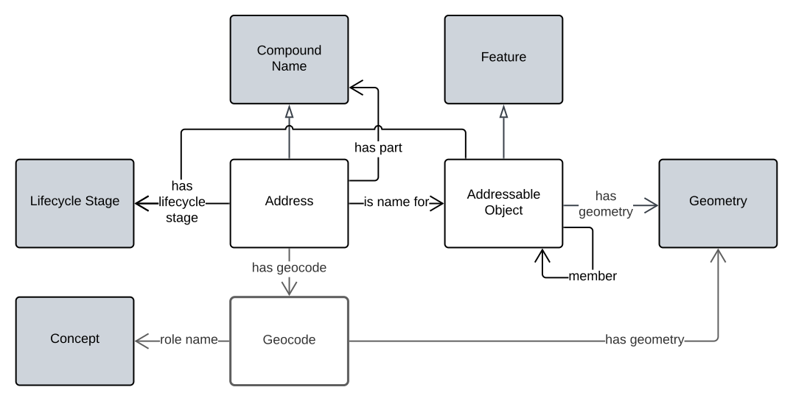

= Address Model
:toc: left
:table-stripes: even
:sectids:
:sectanchors:
:sectnums:

:sectnums!:

==== _A Semantic Web data model used for address information_

[[fig-overview1]]
.An informal model overview diagram showing the major elements of this model

:sectnums:

include::01-metadata.adoc[]

include::02-preamble.adoc[]

include::03-introduction.adoc[]

include::04-model.adoc[]

include::05-supporting-vocabularies.adoc[]

:sectnums!:

include::50-annex-a-requirments.adoc[]

include::51-annex-b-validation.adoc[]

include::52-annex-c-templating.adoc[]

include::53-annex-d-extended-examples.adoc[]

include::99-bibliography.adoc[]